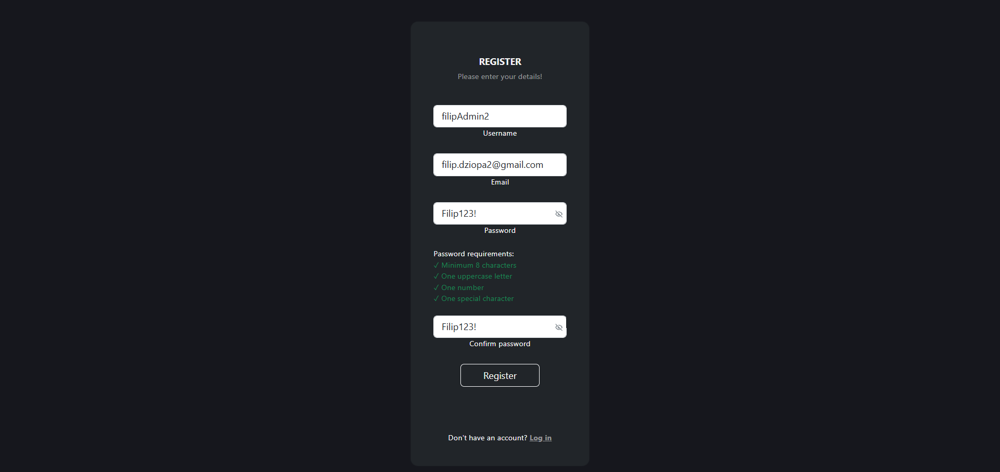
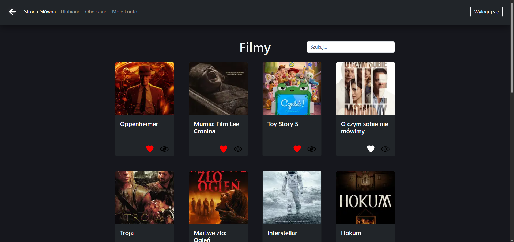
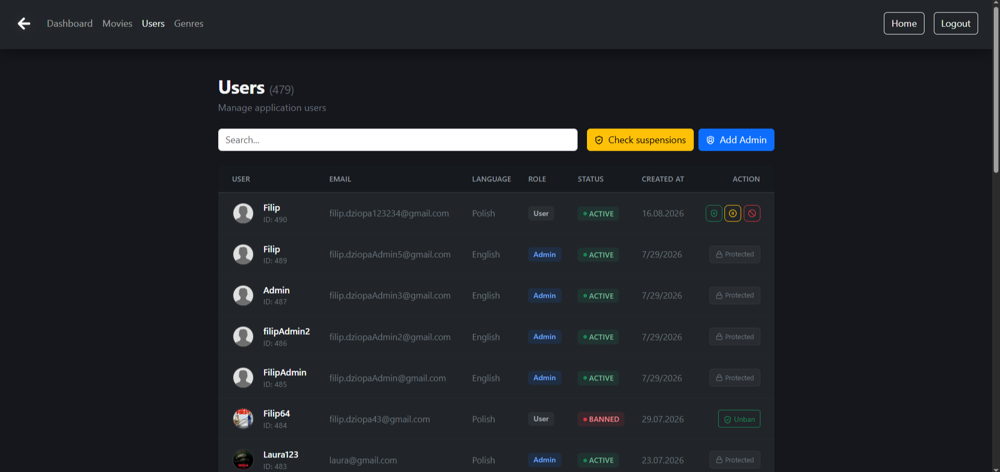
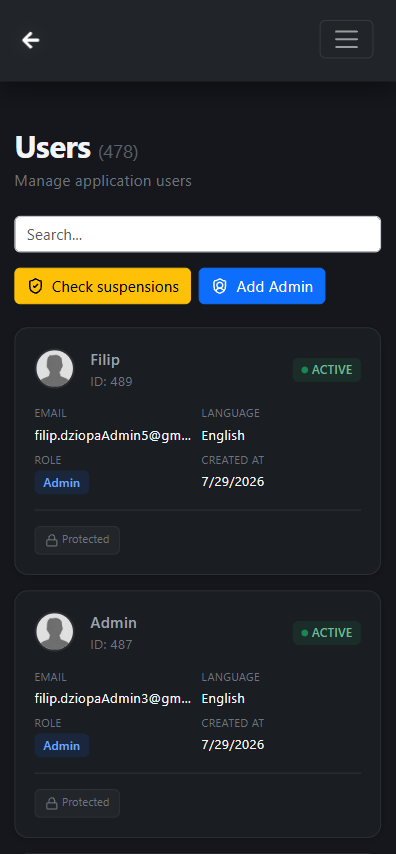

<div align="center">

# 🎬 CINEMIX

### Full-Stack Movie Catalog & Management Platform

Cinemix is a full-stack web application for browsing, searching and managing a movie catalog. 
Users can create accounts, manage favorites and watched movies, customize their profiles and use the application in multiple languages.

The platform also includes a protected administration panel for managing users, genres and movie data.

[](https://react.dev/)
[](https://vitejs.dev/)
[](https://getbootstrap.com/)
[](https://nodejs.org/)
[](https://www.mysql.com/)

**React 19 · Vite · REST API · RBAC · i18n · Server-Side Pagination**

[Frontend Repo](https://github.com/Dziopino/Movies-Frontend) · [Backend Repo](https://github.com/Dziopino/Movies-Backend) · [Live Demo (Coming Soon)](#) · [Screenshots](#-screenshots)

</div>

---

## 📋 Table of Contents

- [Overview](#-overview)
- [Project Status](#-project-status)
- [Tech Stack](#-tech-stack)
- [Architecture](#-architecture)
- [Key Features](#-key-features)
- [Technical Highlights](#-technical-highlights)
- [Project Structure](#-project-structure)
- [API Integration](#-api-integration)
- [Roadmap](#-roadmap)
- [Getting Started](#-getting-started)
- [Environment Variables](#-environment-variables)
- [Screenshots](#-screenshots)
- [Author](#-author)

---

## 🎯 Overview

**Cinemix** is a fully functional, full-stack web application engineered for browsing, searching, and administrating a movie catalog. Built with a modular React 19 frontend and a robust Node.js/Express REST API, it demonstrates full-stack development patterns including **Role-Based Access Control (RBAC)**, **JWT authentication**, **server-side pagination**, **debounced search**, and **internationalization (i18n)**.

The platform serves two distinct user personas:
- **End Users** — browse films, manage personal watchlists, and interact with a localized UI.
- **Administrators** — manage users (ban/suspend/promote), curate genres (CRUD), and oversee film inventory through a protected admin dashboard.

> This repository contains the **Frontend** codebase. The backend API and database schema are maintained in a separate, linked repository.

---

## 🚧 Project Status

> **Current Phase:** Active Development (v0.8 Beta)
>
> The core platform is fully operational — users can register, authenticate, browse films, manage watchlists, and administrators can moderate users and genres. The application is currently being extended with advanced content management, real-time analytics, and audit logging capabilities.
>
> See the [Roadmap](#-roadmap) for upcoming features and architectural enhancements.

---

## 🛠 Tech Stack

### Frontend
| Technology | Purpose |
|------------|---------|
| **React 19** | UI library with functional components and hooks |
| **Vite** | Next-generation frontend build tool for rapid HMR and optimized bundles |
| **React Router DOM v7** | Declarative routing with protected route guards |
| **Bootstrap 5 + Sass** | Responsive grid system and component primitives |
| **Custom CSS Variables** | Theme-aware design system with `prefers-color-scheme: dark` support |
| **i18next + react-i18next** | Comprehensive internationalization engine (PL/EN) |
| **react-hot-toast** | Non-blocking toast notification system |
| **Lucide React** | Consistent, lightweight iconography |

### Backend (Companion Repo)
| Technology | Purpose |
|------------|---------|
| **Node.js + Express** | RESTful API server |
| **MySQL** | Relational database with foreign key constraints and CASCADE behaviors |
| **JWT (jsonwebtoken)** | Stateless authentication |
| **bcrypt** | Secure password hashing |
| **multer + sharp** | Image upload pipeline with WebP compression (300×300, max 2MB) |
| **nodemailer** | Transactional email delivery (password reset flow) |

---

## 🏗 Architecture

```
┌───────────────────────────────────┐
│         React 19 (Vite)           │
│  ┌─────────┐   ┌────────────────┐ │
│  │  Auth   │   │  Film Context  │ │
│  │ Context │   │                │ │
│  └────┬────┘   └────────┬───────┘ │
│       │                 │         │
│  ┌────┴──────┐  ┌───────┴───────┐ │
│  │   Hooks   │  │   Services    │ │
│  │  useAuth  │  │   apiService  │ │
│  │useDebounce│  │   filmService │ │
│  └────┬──────┘  └───────┬───────┘ │
│       │                 │         │
│       └───────┬─────────┘         │
│               ▼                   │
│      HTTP / REST (Fetch API)      │
└───────────────┬───────────────────┘
                │
                ▼
┌─────────────────────────────────┐
│      Node.js / Express API      │
│  ┌─────────────────────────┐    │
│  │  authMiddleware         │    │
│  │  adminMiddleware        │    │
│  │  optionalAuthMiddleware │    │
│  └─────────────────────────┘    │
│               │                 │
│               ▼                 │
│         MySQL Database          │
└─────────────────────────────────┘
```

---

## ✨ Key Features

### End-User Capabilities
- **Dynamic Film Catalog** — Client-side rendered lists with localized titles and descriptions via `film_translations` relation.
- **Intelligent Search** — Debounced query input (500ms) reducing API request overhead; backend SQL `LIKE` filtering.
- **Interactive Watchlists** — Toggle favorites and watched states with immediate UI feedback and persistent storage.
- **Adaptive Theming** — CSS custom properties with automatic dark/light mode detection.
- **Responsive Layout** — Dual-view architecture: data tables for desktop (`lg` breakpoint), card-based layouts for mobile.

### Administrative Capabilities
- **Granular RBAC** — Distinct `User` (role: 0) and `Admin` (role: 1) roles with middleware-enforced route protection.
- **User Lifecycle Management** — Ban, suspend (time-bound), unsuspend, unban, and promote users to administrators.
- **Suspension Auto-Expiry** — Automated status reconciliation: suspended accounts automatically revert to `ACTIVE` when `suspended_until` elapses (checked on login and token validation).
- **Genre CRUD** — Full create/read/update/delete with uniqueness constraints and `ON DELETE CASCADE` integrity.
- **Sensitive Action Verification** — Critical operations (promote, delete genre/film) require re-authentication via administrator password confirmation modal.
- **Batch Suspension Check** — Admin endpoint to mass-reconcile expired suspensions across the user base.

---

## 🔬 Technical Highlights

### 1. JWT Authentication & Route Guards
Implemented a layered security model using React Context (`AuthContext`) paired with backend middleware. The `AdminRoute` component performs client-side role validation before rendering protected admin views, while `authMiddleware` and `adminMiddleware` enforce server-side authorization on every administrative endpoint.

### 2. Role-Based Access Control (RBAC)
The system distinguishes between public, authenticated, and admin-only routes. The `optionalAuthMiddleware` on the backend enables personalized experiences (e.g., showing favorite status) even for unauthenticated guests, without blocking access to public content.

### 3. Server-Side Search & Pagination
Search logic is fully delegated to the database layer using parameterized SQL `LIKE` queries combined with `LIMIT`/`OFFSET` pagination. This ensures consistent performance regardless of dataset size, avoiding frontend memory bottlenecks.

### 4. Debounced Input Handling
A custom `useDebounce` hook encapsulates request throttling logic, reducing API call frequency during rapid user input. This pattern is reused across all search interfaces (films, users, genres) ensuring a performant and cost-effective frontend.

### 5. Modular Admin Dashboard
The admin panel is architected as a self-contained module (`/src/admin/`) with reusable sub-components:
- `IconButton` — standardized action buttons with variant theming.
- `AdminPasswordAuthModal` — universal confirmation gate for destructive or privilege-escalating actions.
- `StatusBadge` / `RoleBadge` — semantic color-coded indicators for user states.

### 6. Internationalization (i18n)
Two-tier localization strategy:
- **UI Layer**: Static translations managed via `i18next` resources (PL/EN).
- **Content Layer**: Dynamic film metadata (titles, descriptions) stored in a normalized `film_translations` table, fetched based on the user's `language_code` preference.

### 7. Responsive Dual-View Layout
Administrative tables utilize Bootstrap's display utilities (`d-none d-lg-block` / `d-lg-none`) to seamlessly transition between dense data tables on desktop and accessible card layouts on mobile — no duplicated logic, only conditional rendering.

### 8. Database Integrity
Relies on foreign key constraints, unique composite indexes (e.g., `user_id` + `film_id` in favorites), and `ON DELETE CASCADE` on junction tables to maintain referential integrity without manual cleanup logic.

---

## 📁 Project Structure

```
Movies-Frontend/
├── docs/                       # Application screenshots
│   ├── admin-users-desktop.png
│   ├── admin-users-mobile.png
│   ├── home-en.png
│   ├── home-pl.png
│   └── register.png
├── public/                     # Static assets (posters moved to backend)
├── src/
│   ├── admin/                  # Admin panel module
│   │   ├── dashboard/          # Analytics & monitoring
│   │   │   ├── DashboardOverview.jsx
│   │   │   ├── FilmAnalytics.jsx
│   │   │   ├── UsersAnalytics.jsx
│   │   │   └── AuditLogs.jsx
│   │   ├── AdminUsers.jsx
│   │   ├── AdminGenres.jsx
│   │   ├── AdminFilms.jsx
│   │   ├── AdminFilmDetails.jsx
│   │   ├── AdminDashboard.jsx
│   │   ├── AdminLayout.jsx
│   │   ├── AdminRoute.jsx      # RBAC route guard
│   │   ├── AdminHeader.jsx
│   │   ├── AdminBanModal.jsx
│   │   ├── AdminSuspendModal.jsx
│   │   ├── AdminPasswordAuthModal.jsx
│   │   ├── AdminAddAdminModal.jsx
│   │   ├── AdminEditGenreModal.jsx
│   │   ├── AdminAddGenre.jsx
│   │   └── AddFilmModal.jsx    # Film creation with poster upload
│   ├── components/             # Shared & user-facing components
│   │   ├── Home.jsx
│   │   ├── Film.jsx
│   │   ├── Favorites.jsx
│   │   ├── Watched.jsx
│   │   ├── Login.jsx
│   │   ├── Register.jsx
│   │   ├── Account.jsx
│   │   ├── ForgotPassword.jsx
│   │   ├── ResetPassword.jsx
│   │   ├── RateLimitAlert.jsx  # 429 error modal with countdown
│   │   ├── Header.jsx
│   │   ├── Footer.jsx
│   │   ├── SearchBar.jsx
│   │   ├── Pagination.jsx
│   │   ├── PasswordInput.jsx   # Toggle password visibility
│   │   ├── PasswordValidator.jsx
│   │   ├── BackButton.jsx
│   │   ├── IconButton.jsx
│   │   ├── UserAvatar.jsx
│   │   ├── RoleBadge.jsx
│   │   ├── StatusBadge.jsx
│   │   ├── StatusMessage.jsx
│   │   ├── PageHeader.jsx
│   │   ├── Stars.jsx
│   │   └── ScrollToTop.js
│   ├── config/                 # API configuration
│   │   └── api.js
│   ├── context/                # Global state containers
│   │   ├── AuthContext.jsx
│   │   ├── ErrorContext.jsx    # Rate limit error handling
│   │   ├── FilmContext.jsx
│   │   └── WarningContext.jsx
│   ├── hooks/                  # Reusable logic abstractions
│   │   ├── useAuth.js
│   │   ├── useDebounce.js
│   │   ├── useFilms.js
│   │   ├── useFilmContext.js
│   │   ├── useWarning.js
│   │   └── useWarningContext.js
│   ├── services/               # API communication layer
│   │   ├── adminService.js
│   │   ├── apiService.js
│   │   ├── filmService.js
│   │   └── userService.js
│   ├── utils/                  # Helper utilities
│   │   ├── axiosConfig.js      # Axios interceptor configuration
│   │   ├── fetchWrapper.js     # Fetch API wrapper
│   │   ├── globalFetchHandler.js # Global rate limit handler
│   │   └── passwordValidator.js
│   ├── App.jsx                 # Application routing
│   ├── i18n.js                 # i18next configuration
│   ├── index.css               # Global styles & CSS variables
│   └── main.jsx                # Entry point
├── index.html
├── package.json
└── vite.config.js
```

---

## 🔌 API Integration

The frontend communicates with the backend via a centralized service layer using the native Fetch API. All authenticated requests include a `Bearer` token retrieved from `localStorage`.

### Key Endpoints

| Method | Endpoint | Auth | Description |
|--------|----------|------|-------------|
| `POST` | `/checkLoginData` | — | Authenticate user, return JWT |
| `POST` | `/addUser` | — | Register new account |
| `POST` | `/getFilms` | Optional | Paginated film catalog with search |
| `GET` | `/getFilm/:id` | Optional | Film details with genres & user states |
| `POST` | `/likeToggle` | JWT | Add/remove favorite |
| `POST` | `/watchedToggle` | JWT | Toggle watched status |
| `POST` | `/likedGet` | JWT | Paginated favorites list |
| `POST` | `/watchedGet` | JWT | Paginated watched list |
| `GET` | `/getUsers` | Admin | User management data |
| `POST` | `/banUser` | Admin | Ban user account |
| `POST` | `/suspendUser` | Admin | Suspend user account |
| `POST` | `/promoteUser` | Admin | Elevate user to admin |
| `GET` | `/getGenres` | Admin | Genre management data |
| `POST` | `/addGenre` | Admin | Create genre |
| `POST` | `/editGenre` | Admin | Update genre |
| `POST` | `/deleteGenre` | Admin | Delete genre (with password auth) |
| `GET` | `/getFilmsAdmin` | Admin | Admin film listing |
| `GET` | `/getFilm/:id` | Admin | Film details for admin editor |
| `GET` | `/getFilmTranslations/:id` | Admin | Fetch all translations for a film |
| `GET` | `/getFilmGenres/:id` | Admin | Fetch assigned genres for a film |
| `GET` | `/getAllGenresList` | Admin | Fetch all available genres |
| `POST` | `/addFilm` | Admin | Create film with poster upload (multipart/form-data) |
| `PUT` | `/updateFilm/:id` | Admin | Update film metadata, translations, genres, and poster |
| `POST` | `/deleteFilm` | Admin | Delete film (with password auth) |
| `GET` | `/api/admin/dashboard/overview` | Admin | Dashboard overview (total films, users, active users) |
| `GET` | `/api/admin/dashboard/films-analytics` | Admin | Film analytics (top films, ratings, genre distribution) |
| `GET` | `/api/admin/dashboard/users-analytics` | Admin | User analytics (registration trends, moderation stats) |
| `GET` | `/api/admin/dashboard/audit-logs` | Admin | Paginated audit logs of user actions |

> Full API documentation is available in the [Movies-Backend](https://github.com/Dziopino/Movies-Backend) repository.

---

## 🗺 Roadmap

The following features are actively planned and represent the next evolutionary phase of the Cinemix platform. Each item is designed to deepen the system's analytical capabilities, administrative oversight, and user experience resilience.

### 🎬 Content Management (Admin Film CRUD)
- [x] **Film Creation Pipeline** — Full admin workflow for adding new films: poster upload with client-side resizing (200×285px) and WebP conversion, metadata input (rating, release date, duration), multi-language translation support, and genre assignment through a searchable multi-select interface with duplicate prevention.
- [x] **Film Details & Editor** — Dedicated admin page (`/admin/films/:id`) displaying comprehensive film information with inline editing mode. Features include:
  - Real-time metadata editing (rating, release date, duration, poster)
  - Complete translation management: view all translations, edit existing ones, add new language versions, remove translations (with English protection)
  - Genre assignment interface: searchable genre picker with instant add/remove
  - Form validation and error handling
  - Atomic updates via backend transactions
- [x] **Translation Manager** — Integrated into film details page: add, edit, or remove localized titles and descriptions per language code with duplicate language prevention and mandatory English translation.
- [x] **Genre Association Engine** — Visual interface in film editor for attaching/detaching multiple genres with live search, immediate persistence via `film_genres` junction table, and `ON DELETE CASCADE` integrity.

### 📊 Analytics & Dashboards (`/admin/dashboard`)
- [x] **Dashboard Overview** — Three-panel KPI dashboard displaying total films count, total users count, and active users count with visual distinction and real-time data fetching.
- [x] **Film Analytics Panel** — Comprehensive film analytics featuring:
  - Top 10 most popular films (horizontal bar chart comparing likes vs. watched counts)
  - Average film rating gauge (circular progress indicator with min/max range)
  - Recent additions metrics (films added in last week/month/year with color-coded KPI cards)
  - Genre distribution (interactive donut chart with sorted legend from largest to smallest segment)
- [x] **User Analytics Panel** — User behavior analytics with:
  - 7-day registration trend (line chart showing new signups over time)
  - Moderation statistics (banned users count, suspended users count with status indicators)
- [x] **Audit Logs Viewer** — Paginated activity stream (50 records/page) tracking user actions on films (like/unlike/watched/unwatched) with username, action type, film title, and timestamp. Includes filter by action type and real-time refresh capability.
- [x] **Interactive Data Visualization** — Responsive, theme-aware charts built with Recharts that adapt to the application's dark mode design system with custom tooltips and legends.
- [ ] **Extended Time-Range Filtering** — Add date range picker for historical analysis beyond 7-day window.
- [ ] **Export Functionality** — CSV/PDF export for analytics reports and audit logs.

### 📜 Audit Logging & Activity Stream
- [x] **User Action Tracking** (`user_activity` table) — Database-backed audit log capturing user interactions with films (favorites added/removed, watched status toggled) with full attribution (user_id, film_id, action type, timestamp).
- [x] **Activity Stream API** — `GET /api/admin/dashboard/audit-logs` endpoint with server-side pagination, action type filtering, and sorted by timestamp descending.
- [x] **Admin Dashboard Integration** — Dedicated "Dziennik audytu" (Audit Logs) tab in admin panel displaying formatted activity feed with translated action labels and film title resolution.
- [ ] **Administrative Action Logging** — Extend audit system to capture admin actions: user bans, suspensions, promotions, genre modifications.
- [ ] **Advanced Filtering** — Query audit logs by specific user, film, date range, and action category with multi-criteria search.
- [ ] **Real-Time Updates** — WebSocket integration for live activity feed updates without manual refresh.

### 🔐 Security Monitoring & Intrusion Detection
- [ ] **Failed Authentication Tracking** — Capturing unsuccessful login attempts with IP metadata, timestamp, and targeted account.
- [ ] **Suspicious Activity Alerts** — Automatic flagging when a single account exceeds a threshold of failed password attempts within a sliding time window.
- [ ] **Security Dashboard Widget** — Visual indicator of recent threats, including brute-force patterns and anomalous access attempts.
- [ ] **Rate Limiting Integration** — Middleware-level protection against credential stuffing and enumeration attacks.

### ⚡ Performance & UX Enhancements
- [ ] **Optimistic UI Updates** — Instantaneous toggle feedback for favorites and watched states before API confirmation, with automatic rollback on request failure to maintain UI consistency.
- [ ] **Skeleton Loaders** — Perceived performance improvement through placeholder shimmer effects during data fetching.
- [ ] **Virtualized Lists** — `react-window` integration for admin tables handling large datasets (10,000+ users/films) without DOM bloat.
- [ ] **Service Worker Caching** — Offline-first strategy for static assets and API response caching via Workbox.

---

## 🚀 Getting Started

### Prerequisites
- [Node.js](https://nodejs.org/) (LTS recommended)
- Running instance of [Movies-Backend](https://github.com/Dziopino/Movies-Backend)

### Installation

```bash
# Clone the repository
git clone https://github.com/Dziopino/Movies-Frontend.git
cd Movies-Frontend

# Install dependencies
npm install

# Configure API endpoint
# Edit src/config/api.js:
# export default { apiUrl: "http://localhost:8000" };

# Start development server
npm run dev
```

The application will be available at `http://localhost:5173`.

### Build for Production

```bash
npm run build
```

Static output is generated in the `dist/` directory.

---

## 🔐 Environment Variables

The frontend relies on the backend's environment configuration. Ensure the backend `.env` is properly set:

```env
PORT=8000
NODE_ENV=development

# Database
DB_HOST=localhost
DB_USER=root
DB_PASSWORD=your_password
DB_NAME=cinemix
DB_PORT=3306

# Security
JWT_SECRET=your_64_byte_hex_secret

# Email (Gmail SMTP)
MAIL_USER=your_email@gmail.com
MAIL_PASSWORD=your_app_password

# CORS
FRONTEND_URL=http://localhost:5173
CORS_ORIGIN=http://localhost:5173
```

---

## 📸 Screenshots

<table>
  <!-- Wiersz 1: Rejestracja i Języki -->
  <tr>
    <td width="33%"><b>1. Register Screen (with Password Validator)</b></td>
    <td width="33%"><b>2. Home Page (EN)</b></td>
    <td width="33%"><b>3. Home Page (PL)</b></td>
  </tr>
  <tr>
    <td></td>
    <td></td>
    <td></td>
  </tr>
  
  <!-- Wiersz 2: Panel Admina i Mobile -->
  <tr>
    <td colspan="2"><b>4. Admin Panel (User Management)</b></td>
    <td><b>5. Mobile View (RWD)</b></td>
  </tr>
  <tr>
    <td colspan="2"></td>
    <td align="center"></td>
  </tr>
</table>

---

## 👤 Author

**Filip Dziopa**

- 🌐 Frontend: [github.com/Dziopino/Movies-Frontend](https://github.com/Dziopino/Movies-Frontend)
- ⚙️ Backend: [github.com/Dziopino/Movies-Backend](https://github.com/Dziopino/Movies-Backend)

---

---

*Copyright © 2026 **Filip Dziopa**. All rights reserved.*

This project is part of my personal development portfolio. The source code is publicly accessible for review and evaluation purposes by recruiters and technical interviewers only. No part of this repository may be duplicated, modified, or redistributed without explicit written permission from the author.

---

<div align="center">

**[⬆ Back to Top](#-cinemix)**

Built with precision. Designed for scale.


</div>
